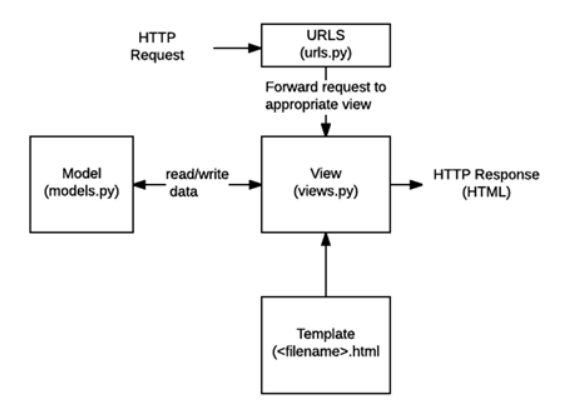
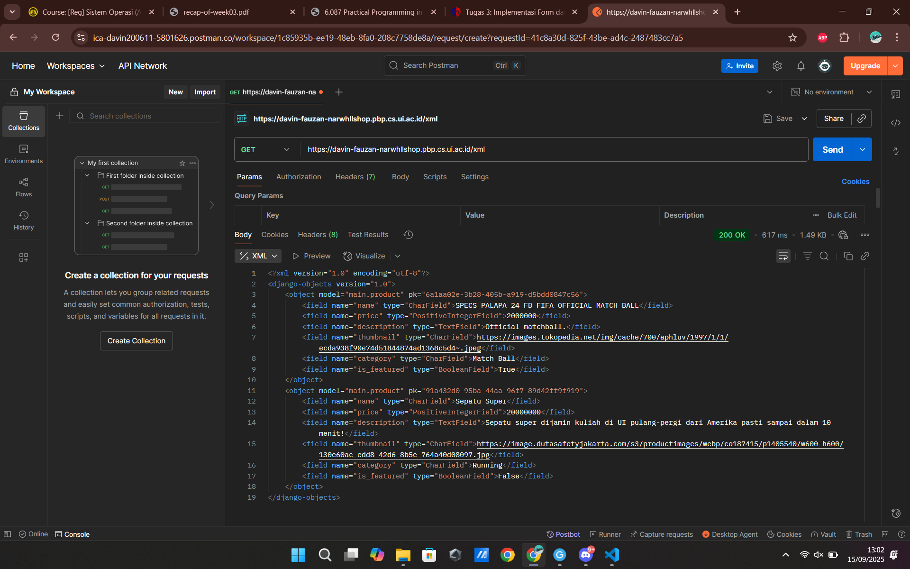
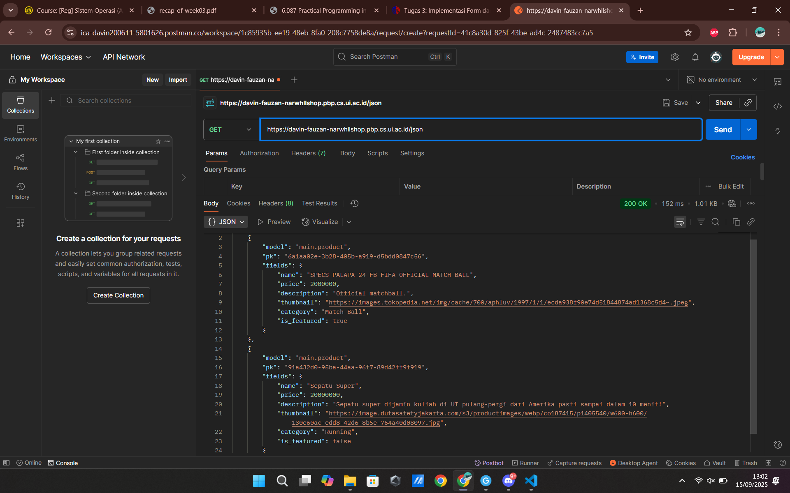
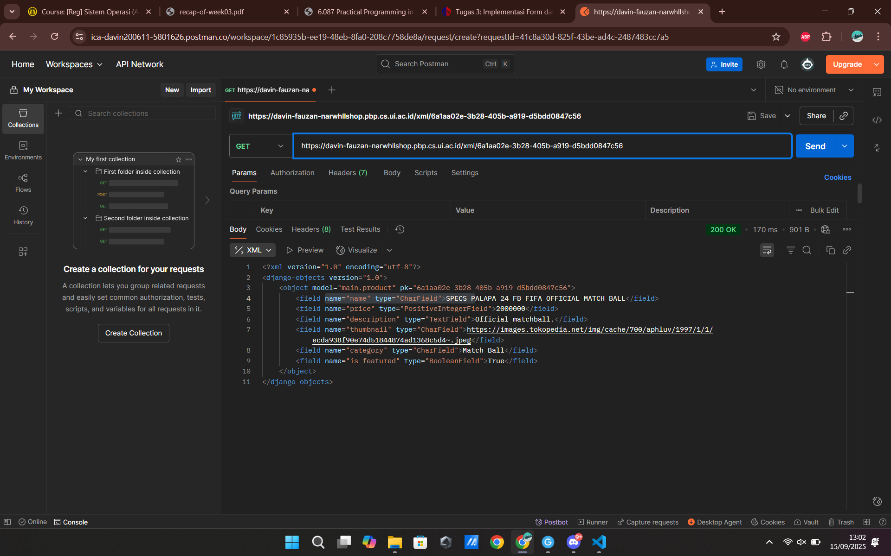
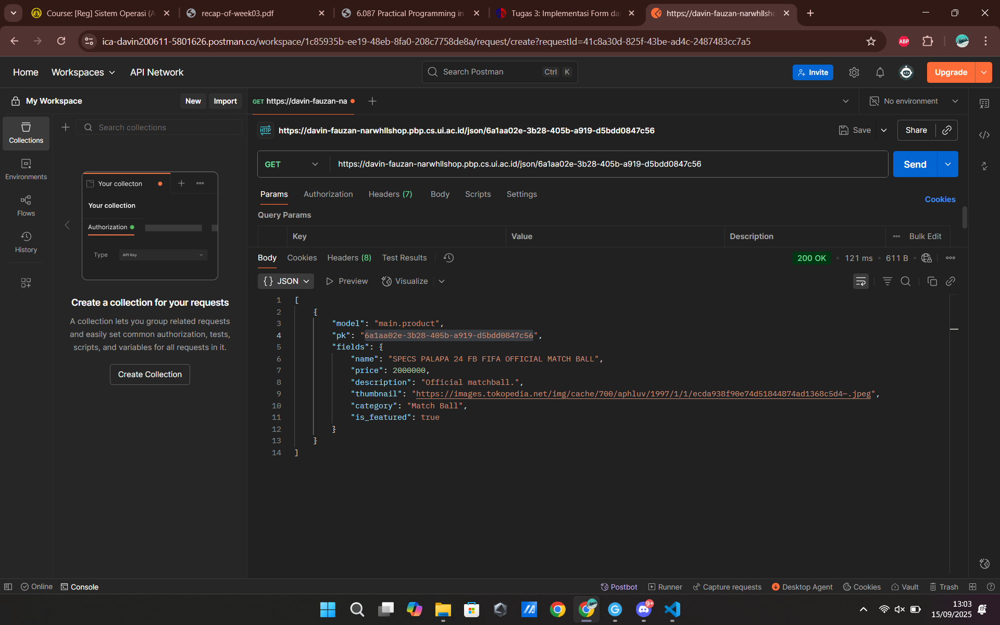

Davin Fauzan Akmalianto 2406409504 
Link = https://davin-fauzan-narwhllshop.pbp.cs.ui.ac.id/

<h1> TUGAS 2 </h1>

1. 
 - "Membuat sebuah proyek Django baru." = membuat virtual environment dalam folder narwhll-shop, kemudian menginstall requirements yang diperlukan untuk memulai sebuah project django melalui sebuah .txt, kemudian menjalankan proyek dengan command yang disediakan django. setelah itu, membuat file .env serta .env.prod untuk membuat pengaturan environment untuk sesi production dan sesi non production.
 - "Membuat aplikasi dengan nama main pada proyek tersebut." =  menjalankan command 'python manage.py runserver main'.
 - "Melakukan routing pada proyek agar dapat menjalankan aplikasi main." = menyantumkan path('', include('main.urls')) dalam urlpatterns di file urls.py pada folder narwhll_shop, agar mengroute path default untuk menampilkan urls yang ada di folder main.
 - "Membuat model pada aplikasi main dengan nama Product beserta atribut atribut wajib." = mengedit file models.py yang berada di folder main, kemudian membuat atribut atribut dengan tipe datanya masing-masing sesuai arahan tugas.
 - "Membuat sebuah fungsi pada views.py untuk dikembalikan ke dalam sebuah template HTML yang menampilkan nama aplikasi serta nama dan kelas kamu." = pada views.py, buat fungsi untuk mencantumkan konteks/data yang diperlukan untuk menampilkan main.html, contoh menyantumkan value npm agar di main.html dapat ditampilkan valuenya, kemudian render main.html
 - "Membuat sebuah routing pada urls.py aplikasi main untuk memetakan fungsi yang telah dibuat pada views.py." = pada urls.py yang terdapat di folder aplikasi main, import file views.py lalu jadikan path '' (path default) sebagai path yang mereturn fungsi show_main.  
 - "Melakukan deployment ke PWS terhadap aplikasi yang sudah dibuat sehingga nantinya dapat diakses oleh teman-temanmu melalui Internet." = mengikuti rangkaian pembuatan proyek di pws, kemudian mencantumkan link kedalam list ALLOWED_HOST pada file settings.py agar web dapat menjadi host aplikasi. 

2.  
    
    image dari scele: [Link SCELE](https://scele.cs.ui.ac.id/pluginfile.php/269605/mod_resource/content/1/03%20-%20MTV%20Django%20Architecture.pdf)
    urls.py menerima request dari client, kemudian meneruskan request tersebut kepada views.py. Tugas views.py disini adalah mereturn main.html dengan informasi/konteks yang tersedia pada views.py. Contohnya disini, main.html menampilkan npm yang disediakan dari views.py. Models.py berfungsi sebagai definisi dari data yang akan kita pakai dalam aplikasi (seperti class).
 
3. file settings.py digunakan untuk membuat beberapa aturan yang diperlukan agar aplikasi berjalan dengan baik. contohnya seperti membuat list allowed_hosts, dimana itu berfungsi sebagai pengatur siapa saja yang boleh menghost aplikasi kita.

4. migrasi database dilakukan dengan cara menyimpan file models.py pada aplikasi, lalu menjalankan command python manage.py makemigrations, command ini akan menyiapkan untuk melakukan migrate (seperti ancang ancang), kemudian jalankan command python manage.py migrate untuk mengaplikasikan model kedalam database.

5. menurut saya, framework django dijadikan permulaan belajar karena sangat praktis untuk digunakan, dan ramah untuk pemula. Semua yang dibutuhkan pemula juga sudah ada di package django.

6. tidak ada.

 

<h1> TUGAS 3 </h1>

1. Data delivery sangat dibutuhkan dalam pengimplementasian sebuah platform agar sebagai programmer kita dapat dengan mudah mengakses serta menggunakan data yang dibutuhkan dalam kode kita.

2. JSON, karena secara visual juga lebih mudah dicerna dibandingkan dengan XML, serta lebih praktis. XML juga membutuhkan waktu yg lebih lama untuk di-parse. Kalau dokumennya sangat kompleks, mungkin XML akan lebih digunakan.

3. is_valid() digunakan untuk memvalidasi isi dari form yang telah disediakan. Apabila semua sudah sesuai dengan tipe data yang ditentukan, maka is_valid akan bernilai True, dan sebaliknya.

4. csrf_token adalah sebuah token yang di generate ketika user sedang menggunakan website (atau sedang login ke web tersebut). Token user kemudian akan di crosscheck dengan token yang menempel ketika melakukan sebuah request. Apabila token user sama dengan token yang membuat request, maka prosesi akan dilanjutkan, sementara jika berbeda akan gagal. CSRF_Token sangat berguna dalam mengatasi serangan dari para hacker/penipu yang ingin mengakses akun user. Apabila tidak memakai csrf_token, penyerang dengan mudah bisa mengirimkan kita sebuah link yang sudah berisi request misal mentransfer uang. Ketika kita klik, karena kita sudah login ke web tersebut, prosesi transfer akan langsung dilakukan karena tidak adanya crosscheck token csrf.

5. 
- "Tambahkan 4 fungsi views baru untuk melihat objek yang sudah ditambahkan dalam format XML, JSON, XML by ID, dan JSON by ID." =
Buat keempat fungsi tersebut dengan mengimpor serializers, yaitu suatu fungsi yang digunakan untuk mem-parse informasi ke xml/json.
- "Membuat routing URL untuk masing-masing views yang telah ditambahkan pada poin 1." =
Setelah membuat keempat fungsi tersebut, buat path mereka masing-masing di dalam file urls.py yang terdapat di direktori main. 
- "Membuat halaman yang menampilkan data objek model yang memiliki tombol "Add" yang akan redirect ke halaman form, serta tombol "Detail" pada setiap data objek model yang akan menampilkan halaman detail objek." = 
Dalam main.html yang telah dibuat sebelumnya, buat for loop yang akan menampilkan bbrp detail model, disini saya membuat agar yang ditampilkan hanya yang featured, selengkapnya ada page lain yang menampilkan semua model. Kemudian di main.html tambahkan button Add yang mengdirect ke create.html. Untuk detail setiap objek, saya membuat agar title dari tiap model langsung merujuk kepada detail model tersebut.
- "Membuat halaman form untuk menambahkan objek model pada app sebelumnya" = 
Disini saya membuat page create.html untuk menjadi page yang menampilkan form untuk menambah model Product. Sebelum itu, saya membuat forms.py pada main untuk membuat class yang menjadi dasar dari form yang dibuat untuk model Product. Setelah itu, saya membuat fungsi create_product pada views.py untuk menyimpan isi form ketika form sudah valid, serta mengdirect user ke laman utama ketika kelar. Fungsi ini menjadi base dari fungsi form ketika belum submit apa apa.
- "Membuat halaman yang menampilkan detail dari setiap data objek model."
Saya membuat page product_detail.html yang menampilkan semua atribut dari model Product. Page ini dapat diakses dari mengklik judul/nama dari model pada website.

6. Tidak ada, sudah sangat baik.

7. Postman:
XML = 
JSON = 
XML by ID = 
JSON by ID = 

 

<h1>TUGAS 4</h1>

1. AuthenticationForm adalah sebuah class dari django yang memungkinkan pembuat untuk mengadakan form login yang telah dibuat oleh django. Kelebihannya adalah class ini mempermudah programmer agar tidak perlu membuat formnya secara manual dengan html. Kelemahannya mungkin adalah kurang fleksibel dibandingkan dengan membuat form sendiri. 

2. Autentikasi dengan otorisasi sangat berbeda. Otorisasi memberikan hak akses yang beragam ke tiap user, contohnya seperti memberi hak admin, ataupun hak sebagai guest. Sedangkan autentikasi merupakan sebuah proses memverifikasi identitas sebuah user, yang memungkinkan user untuk login. Contoh implementasi autentikasi adalah AuthenticationForm, yang memungkinkan kita untuk login kepada suatu akun. Kemudian contoh implementasi otorisasi adalah @login_required yang terdapat pada fungsi show_main, berfungsi untuk tidak membiarkan orang2 yang tidak punya akun (tidak punya hak) untuk melihat tampilan utama web.

3. Kelebihan cookies dibanding session adalah kemampuannya untuk tetap ada bahkan setelah browser ditutup, membuat proses jadi semakin cepat. Cache juga akan bertahan meskipun pada browser yang berbeda window. Namun, ukuran cache kecil, jadi apabila data yang ingin disimpan terlalu banyak, maka cache tidak bisa menjadi suatu solusi, berbeda dengan session yang memiliki ukuran lebih besar. Session juga cenderung lebih aman karena semua data disimpan di server, kita hanya menyimpan sessionId kedalam cookies, kemudian sessionId akan mencocokan dengan data yang terdapat pada server untuk dipanggil.

4. Menggunakan cookies sebagai penyimpan data user mempunyai resiko dibobol, namun di django, secara default cookies akan digunakan untuk menyimpan sessionId, jadi tidak menggunakan cookies sebagai penyimpan data user. 

5. - **Mengimplementasikan fungsi registrasi, login, dan logout untuk memungkinkan pengguna mengakses aplikasi sebelumnya sesuai dengan status login/logoutnya.** =
Pertama, import User dalam models.py agar dapat mengimplementasikan User dalam model Product. Setelah itu, buat fungsi register pada views.py dengan mengimport UserCreationForm bawaan dari Django. Kemudian, import juga AuthenticationForm beserta dengan login dan logout agar dapat mengimplementasikan fungsi autentikasi. Kemudian, daftarkan masing2 fungsi kedalam urlspatternnya masing masing. Lalu, tambahkan @login_required pada semua page yang sekiranya membutuhkan authentikasi, seperti show_main, create_product, myproducts, dll.

- **Membuat dua (2) akun pengguna dengan masing-masing tiga (3) dummy data menggunakan model yang telah dibuat sebelumnya untuk setiap akun di lokal.** =
Membuat 2 akun asal kemudian membuat 3 produk random agar membuktikan kalau program berjalan dengan lancar.

- **Menghubungkan model Product dengan User.** = 
Setelah mengimpor User ke dalam models.py, terapkan user ke model Product, dengan foreign key berupa atribut user yang menjadi penghubung antar Product dengan User.

- **Menampilkan detail informasi pengguna yang sedang logged in seperti username dan menerapkan cookies seperti last_login pada halaman utama aplikasi.** = 
Import HttpResponseRedirect terlebih dahulu di views.py, agar dapat menyimpan cookie ke browser, setelah itu langsung redirect ke page yang diinginkan. Pada fungsi login_user, simpan informasi datetime ketika login dalam bentuk cookies, yang kemudian di masukkan context pada show_main agar dapat ditampilkan. Pada main.html, siapkan template untuk menampilkan nama user yang didapat dari request.user.username, dan juga informasi last_login.